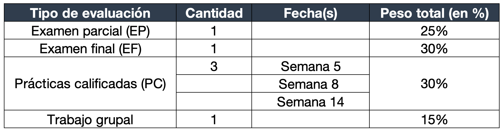

**FACULTAD DE CIENCIAS SOCIALES - PUCP**

Curso: SOC294 - Estadística para el análisis sociológico 1

Semestre 2024 - 2

```{=html}
<style>
.custom-text {
  color: #00688B;
  font-family: Helvetica, sans-serif;
  text-align: center;
  font-weight: bold;
  font-size: 24 px;
}
</style>
```
::: custom-text
Bienvenidos al curso "Estadística para el Análisis Sociológico 1".
:::

## 1. Sumilla

Es un curso teórico y/o práctico que contribuye al logro de las competencias de Investigación. Incluye los siguientes temas: escalas de medición, variables e índices; estadística descriptiva (resúmenes tabulares, gráficos y numéricos); inferencia estadística, la distribución normal y estimación de parámetros; pruebas de hipótesis paramétricas y no paramétricas; análisis de tablas de contingencia; medidas de asociación bivariables; análisis de la varianza; regresión simple.

## 2. Presentación

El curso de Estadística para el Análisis Sociológico 1 busca presentar al estudiante con herramientas que le permitan familiarizarse con el análisis cuantitativo de fenómenos sociales. Construiremos sobre la base de conocimientos previos para comprender mejor el análisis descriptivo e inferencial bivariado.

El curso se divide en sesiones teóricas y prácticas. Las sesiones teóricas buscan presentar y discutir los fundamentos del análisis cuantitativo. Las sesiones prácticas se enfocarán en el manejo de R con ejemplos prácticos.

## 3. Evaluación


