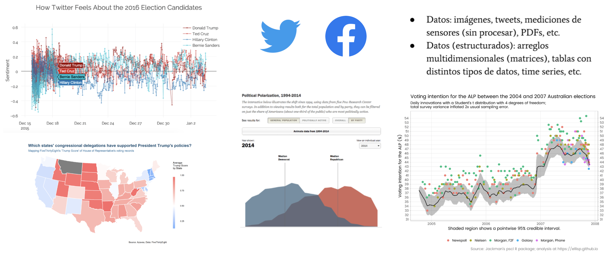
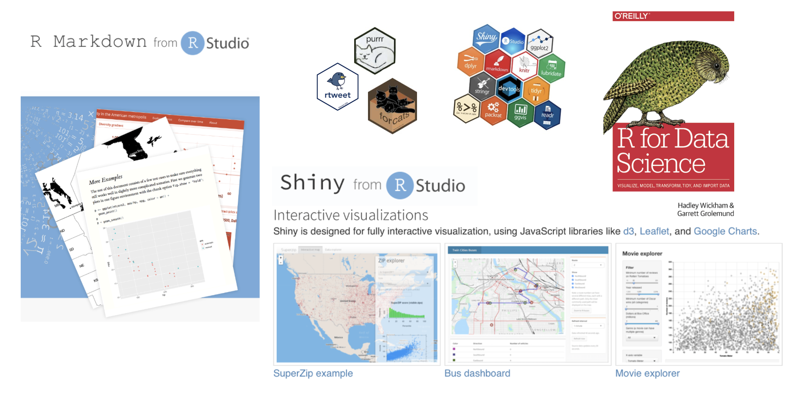
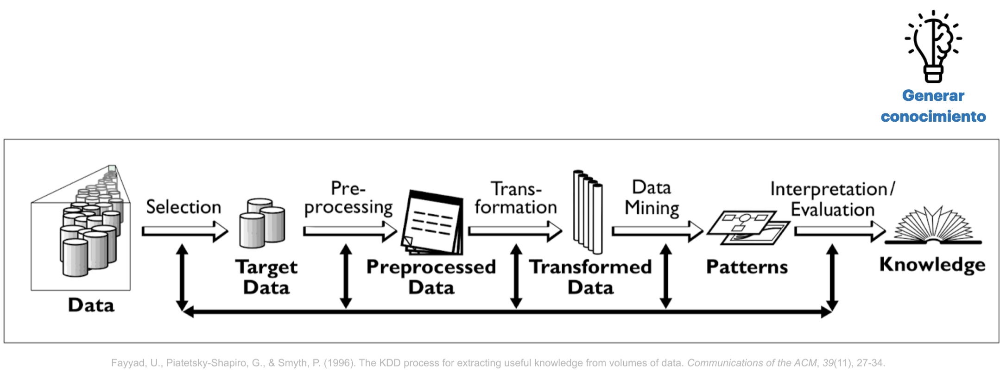
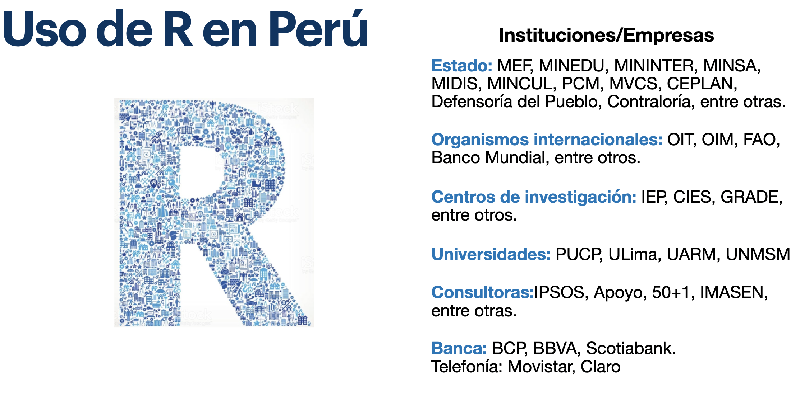
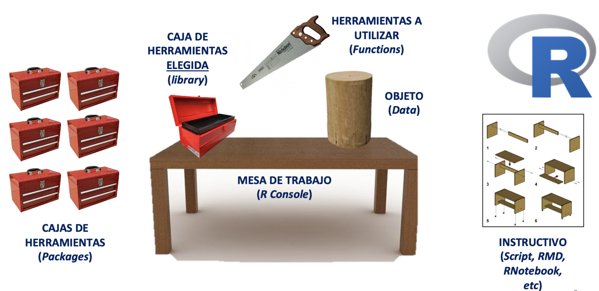
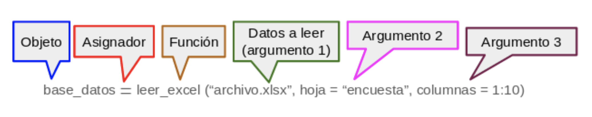
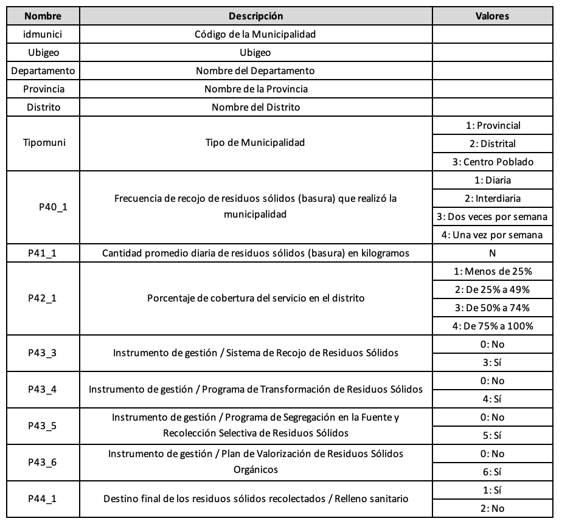

**FACULTAD DE CIENCIAS SOCIALES - PUCP**

Curso: SOC294 - Estadística para el análisis sociológico 1

Semestre 2024 - 2

# **1. ¿Qué es R?**

R es un lenguaje de programación y un entorno de software libre y de código abierto utilizado para análisis estadístico y visualización de datos. Fue desarrollado por Ross Ihaka y Robert Gentleman en la Universidad de Auckland, Nueva Zelanda, en 1993. Desde entonces, ha sido ampliamente adoptado por la comunidad científica y empresarial como una herramienta esencial para el análisis y la visualización de datos.

R cuenta con una amplia variedad de paquetes y bibliotecas que permiten el análisis estadístico, la minería de datos, el aprendizaje automático, la visualización de datos y la generación de informes. Además, su sintaxis es relativamente sencilla, lo que facilita su aprendizaje y uso para personas con distintos niveles de experiencia en programación, lo cual ha significado su uso en diversos rubros.

```{r echo=FALSE}
library(vembedr)

embed_youtube("ZCQHm63xc4s")
```

------------------------------------------------------------------------

<a id='part2'></a>

# **2. ¿Qué podemos hacer con R?**









------------------------------------------------------------------------

<a id='part3'></a>

# **3. Conceptos básicos para programar en R**

Instalar [R](http://www.r-project.org)

Instalar [RStudio](https://posit.co/downloads/)

### Usando R



#### **3.1. Configurar el directorio de trabajo**

R funciona como un entorno temporal de trabajo, lo que quiere decir que el usuario va agregando datos y objetos. Sin embargo, si los análisis no son guardados se deberán repetir las instrucciones para obtener otra vez el resultado. Por esta razón, es preciso configurar una carpeta predeterminada en nuestro ordenador, donde el programa buscará los archivos a ejecutar y guardará los archivos a conservar con cambios.

Para ver nuestro lugar de trabajo actual escribimos el siguiente comando (escriba el código en la consola, ya que si lo ejecuta desde este Rmd, obtendrá el lugar donde se encuentra este archivo):

```{r}
getwd() #para saber en qué carpeta está el archivo
```

Si queremos cambiar de directorio de trabajo, nos dirigirnos al menú **"Session" \> "Set Working Directory" \> "Choose Directory"**. Esto abrirá una ventana emergente, donde buscaremos la carpeta en la cual vamos a trabajar, la ubicamos y seleccionamos "Open". Para verificar el cambio volvemos a digitar la función **"getwd()"** en la consola.

#### **3.2. Sintaxis y objetos en R**

El uso de R es bastante intuitivo y sigue un patrón lógico. Está compuesto de códigos y la combinación de estos códigos genera una sintaxis. Asimismo, R guarda la información de nuestras observaciones y variables a través de objetos.

En un sentido global, la estructura general de una sintaxis puede resumirse como sigue: a un objeto dado se le asigna el resultado de una función, que a su vez se ejecuta sobre un conjunto de datos especificado, con una serie de configuraciones particulares. Veamos el siguiente ejemplo ficticio.



Si se lee de izquierda a derecha, la línea de comando puede explicarse como sigue:

-   Primero se indica un objeto a crear, con el nombre que ustedes definan.

-   Luego se indica el asignador, que expresa que todo lo que esté a la derecha de la flecha se guardará en el objeto creado a la izquierda. El asignador puede ser "\<-" o también "=", para motivos del curso usaremos este último.

-   Luego viene la función que en este caso permite leer archivos tipo Microsoft Excel. R trabaja con funciones que están dentro de "paquetes" que la comunidad va desarrollando. Podemos hacer nuestras operaciones con diversas funciones, y no hay una sola forma de hacerlo. Si se trata de funciones que no están predeterminadas en R, debemos instalar el paquete que las contiene con el comando "install.packages()", y antes de ejecutarla debemos abrir la libreria con el comando "library()"

-   Luego de la función, se abre un paréntesis que contiene los argumentos: instrucciones que especifican ciertos detalles de lo que queramos que la función realice. Los argumentos pueden escribirse de distintas maneras y va a depender de lo que queramos hacer. En nuestro ejemplo: El primer argumento indica la información a leer, en este caso indica un archivo de tipo Excel (extensión xlsx). El segundo argumento indica la hoja del archivo a leer. El tercer argumento indica qué columnas se leerán de forma específica (en este caso, las primeras diez).

    3.2.1 Las funciones más usadas

    Explicar estructura data \$ variable

-   names: textito de explicación

    ```{r}
    names(iris)
    ```

-   str:

    ```{r}

    ```

-   class:

    ```{r}

    ```

-   table: Utiliza factores de clasificación para construir una tabla de los recuentos en cada combinación de niveles de factores.

    ```{r}
table(iris$Species)
    ```

-   mean: La media aritmética de un conjunto de datos

    ```{r}
mean(iris$Sepal.Length)
    ```

-   sum: La suma de todos los valores dentro de un cojunto de datos

    ```{r}
sum(iris$Petal.Length)
    ```

# **4. Apliquemos lo aprendido**

Antes de aplicar los códigos revisados, debemos importar la base de datos a usar en R. Para eso debemos asegurarnos de dos cosas:

1.  Que la base de datos se encuentra en el directorio de trabajo (carpeta indicada líneas arriba).
2.  Haber llamado a la librería que nos permitirá abrir la base de datos. En este curso usaremos "rio", esta librería o paquete admite una amplia variedad de formatos (xlsx, sav, dta, etc.) con el mismo comando: import.

Para esta sesión, trabajaremos con Registro Nacional de Municipalidades (RENAMU). Pequeño texto sobre renamu: Sebastian

```{r}
library(rio)
data = import("RENAMU_RESIDUOS.xlsx")
```




Para abrir la base usamos dos líneas de código. La primera indica el llamado del paquete rio. Sin llamar al paquete no se podrá solicitar el uso de la función de este. Haciendo la analogía a la imagen anterior, no puedes usar una herramienta (comando) sin seleccionar y abrir antes la caja que la contiene.

La segunda línea de código tiene 4 elementos

1.  data: Este es el nombre del **objeto** en R. En este caso este objeto es una base. Siempre que importemos debemos asignarle un nombre para luego poder referirnos a este en el código.
2.  = : Es el asignador, sin este símbolo no podré decirle qué contendrá el objeto "data". También es común usar "\<-"
3.  import(): Es la función. Es lo que contiene las directrices que le indica a R qué debe hacer. Esta función tiene como único argumento fundamental el nombre del archivo a importar.
4.  "RENAMU_RESIDUOS.xlsx": Es el nombre del archivo dentro de tu computadora. Este nombre va entre comillas siempre entre comillas. Para R, cada texto del código tiene una utilidad, si el nombre del archivo no tiene comillas, el programa interpretará que es una función y al no encontrarla arrojará error.

Usemos los códigos que acabamos de aprender

```{r}
#names
```

```{r}
#str
```

```{r}
#class(P40_1)
```

S

```{r}
#"table" para conocer la distribución del porcentaje de cobertura del servicio de recojo de basura en el distrito
table(data$P42_1)
```

```{r}
#"mean" para saber el promedio diario de residuos sólidos de basura en kilogramos de todos los distritos
mean(data$P41_1, na.rm = TRUE)
```

```{r}
#"sum" para sumar la cantidad diaria promedio de residuos de basura en kilogramos de todos los distritos
sum(data$P41_1, na.rm = TRUE)
```

## 4.1 Tidyverse

Agregar loguito

Tidyverse es un conjunto de de paquetes de R para ciencia de datos, nos ayuda a trabajar las bases de datos. Ha sido desarrollado por RStudio.

-   **Es consistente** : Todos los paquetes tienen una misma estructura

-   **Concatenable**: Siempre se pueden unir pequeñas partes para resolverlos

-   **Funcional**: Como casi todo R, promueve la programación

Para cada paso de tratamiento de datos existe un paquete, se puede pasar desde cargar/importar los datos, limpiarlos, transformarlos, visualizar, modelarlos y finalmente comunicarlos.

Para importar datos tenemos readr, haven y readxl. Para limpiar los datos usamos tidyr, para transformar los datos se usa dyplr, que lo veremos a continuación, para modelar se usa purr o broom, para visualizar se usa ggplot2. Finalmente, para comunicar se usa knitr para publicar los resultados por html, pdf, ppt. y rmarkdown es la estructura de knitr.

Algunos les gusta usarlo porque facilita el análisis y manipulación de datos y es más rápido, pero, por otro lado, tiene otra lógica en la programación. En vez de usar "," para diferenciar entre comandos, usar %\>%.

Instalando el paquete de tidyverse te incluye los 8 paquetes. Pero, eso sí, toma más tiempo de lo debido. Por eso, en esta ocasión, se ha descargado los que necesitaremos ahora

### 4.1.1 Dplyr

El paquete dplyr es el más útil en R para la manipulación de datos, una de las ventajas es que se pueda usar el pipe para combinar diferentes funciones en R. Para no tener que escribirlo, se genera mediante Ctlr + shift + M. En pocas palabras, reemplaza la "," para concatenar(unir) varios comandos.

```{r}
library(dplyr)
```


Revisemos alguno de sus comandos:

-   select

    ```{r}
    #Seleccionar solo las P41_1 y  P43_algo
    ```

-   summarise

    ```{r}
#"sumamarise" es una función que se utiliza para crear resúmenes estadísticos de un conjunto de datos. En este caso, para conocer la cantidad máxima de basura producida y la fila (observación) que la ha producido.
summarise(data, max_basura = max(P41_1, na.rm = TRUE), fila_max_basura = which.max(P41_1))
    ```

-   filter

    ```{r}
#"filter" se utiliza para crear un subconjunto de datos de determinadas filas que cumplan con una condición dada. Específicamente, deseamos quedarnos con los casos que Sí informen un Plan de Valorización de Residuos Sólidos Orgánicos
filter(data, P43_6 == "6")
    ```
