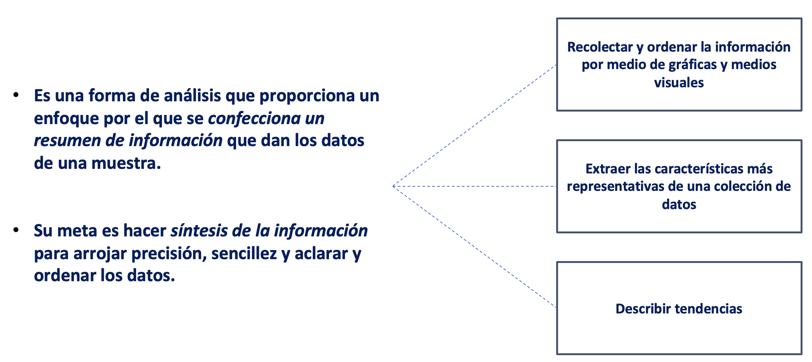
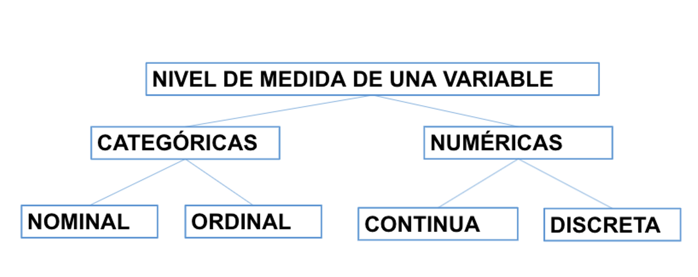
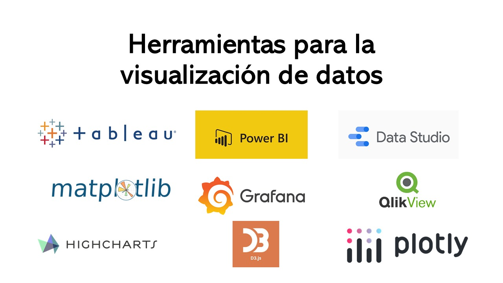
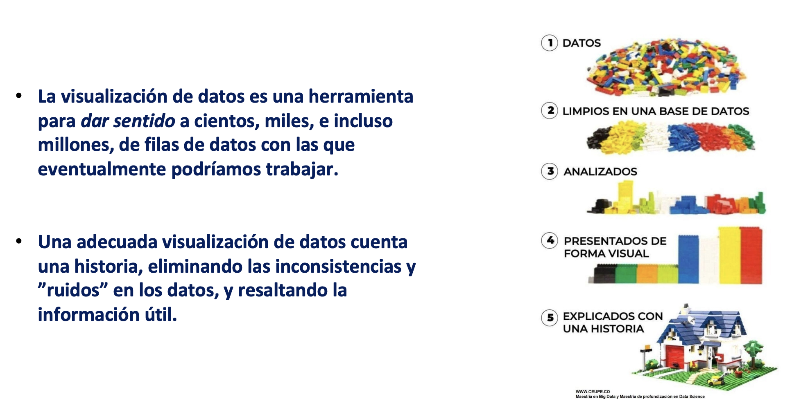
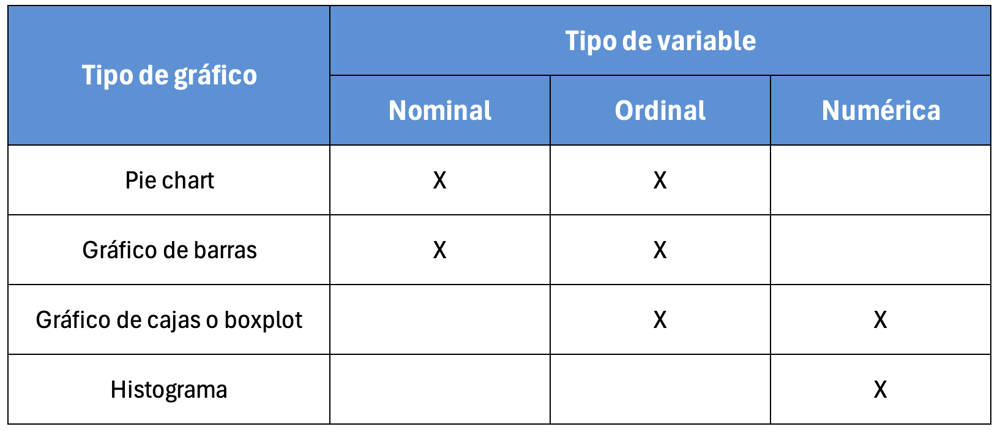
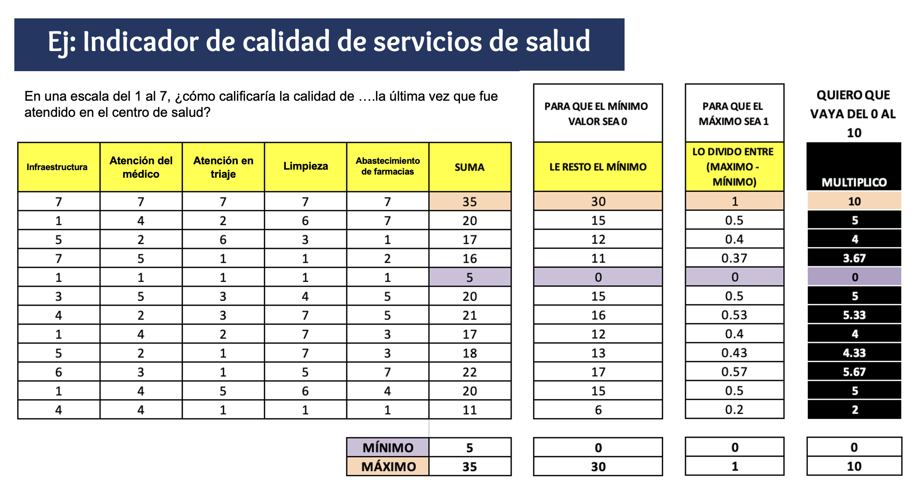

**FACULTAD DE CIENCIAS SOCIALES - PUCP**

Curso: SOC294 - Estadística para el análisis sociológico 1

Semestre 2024 - 2

# **1.¿Qué es el análisis descriptivo?**

```{r,echo=FALSE, out.width="80%",fig.align="center"}
 
```

# **2.Nivel de medida de una variable**

```{r,echo=FALSE, out.width="50%",fig.align="center"}
 
```

# **3.Importancia de visualización de datos**

Debido al crecimiento de la big data en los últimos años surgieron nuevas necesidades para comprender los análisis masivos de datos de una forma simple y escalable. Es entonces cuando se dirige la atención a desarrollar nuevas técnicas gráficas en distintas plataformas (ejemplos a continuación), tanto softwares como librerías de código abierto[^1], tal es el caso de ggplot2 en R.

[^1]: <https://www.data-to-viz.com/caveat/pie.html>

```{r,echo=FALSE, out.width="90%",fig.align="center"}
 
```

Este interés por desarrollar técnicas de análisis masivo de datos y la comunicación de resultados cada vez más amigables y apta para todos los públicos dio pie a nuevas especialidades dentro de la ciencia de datos, como por ejemplo el data story telling

```{r,echo=FALSE, out.width="90%",fig.align="center"}
 
```

### **Gráficos por tipo de variables:**

```{r,echo=FALSE, out.width="60%",fig.align="center"}
 
```

# **4.Análisis descriptivo**

```{=html}
<style>
.custom-text {
  color: #00688B;
  font-family: Helvetica, sans-serif;
  text-align: center;
  font-weight: bold;
  font-size: 22px;
}
</style>
```
::: custom-text
::: custom-text
¿Cuál es la distribución y dinámica de las manifestaciones sociales en el Perú? 🤔
:::
:::

Para la sesión de hoy se usará la **"Base de eventos de protesta (1980 - 2023)",** agregada a nivel regional. Esta fue inicialmente creada por Moisés Arce, profesor de la Universidad de Tulane, y recientemente actualizada por la Escuela de Gobierno y Políticas Públicas de la PUCP. Esta base es un aporte para estudiar y comprender mejor la dinámica de la conflictividad popular en el Perú desde 1980 hasta la actualidad. Encuentra más información y la base de datos original en el siguiente [link](https://democracia-gobernabilidad.pucp.edu.pe/participaci%C3%B3n/protestas-sociales).

```{r,message=FALSE,warning=FALSE}
library(rio)
data = import("pd2_Protestas.xlsx")
```

Agregar diccionario

```{r,echo=FALSE, out.width="100%",fig.align="center"}
knitr::include_graphics("pd2_diccionario.png") 
```

## 4.1 ¿Cómo se distribuye (%) las protestas en el Perú a nivel regional?

Abrimos la librería dplyr

```{r, warning=FALSE,message=FALSE}
library(dplyr)
```

Comprobamos el tipo de variable que queremos utilizar

```{r}
class(data$Región)
```

Creamos un summarise donde se encuentre la región y su frecuencia

```{r}
data %>% 
  group_by(Región) %>% 
  summarise(Total = sum(Total))
```

Es posible crear una table que incluya tanto frecuencias como porcentajes añadiendo una línea al comando anterior. Además, para poder representar los resultados en un gráfico, necesitamos guardar esta tabla en un objeto. Usemos esta tabla resumida y asignémosle el nombre "gráfico1", de manera que podamos referirnos a ella cuando creemos el gráfico

```{r}
gráfico1 <- data %>% 
  group_by(Región) %>% 
  summarise(Total = sum(Total)) %>% 
  mutate(Porcentaje = (Total / sum(Total))*100)

gráfico1
```

Un breve ejemplo. Podemos realizar la misma situación, inclusive, filtrando. En este caso, nos quedamos solamente con aquellas regiones que tienen por sector común a la ciudadanía. Podemos filtrar de distintas maneras.

```{r}
data %>% filter(Sector_comun=="Ciudadanía") %>% 
  group_by(Región) %>% 
  summarise(Total = sum(Total)) %>% 
  mutate(Porcentaje = (Total / sum(Total))*100)
```

Graficamos "gráfico1" con todas las regiones del Perú

```{r}
library(ggplot2)

ggplot(gráfico1, aes(x=Región, y=Porcentaje, fill=Región)) + 
  geom_bar(stat = "identity") + 
  theme_bw()
```

El gráfico anterior, sin embargo, posee demasiada información, por lo cual es difícil de observar con claridad. Por lo cual, nos quedaremos solamente con las 5 regiones con mayores porcentajes de protestas sociales, llamándolo "gráfico2"

```{r}
gráfico2 <- data %>%
  group_by(Región) %>% 
  summarise(Total = sum(Total)) %>% 
  mutate(Porcentaje = (Total / sum(Total))*100) %>%
  arrange(desc(Porcentaje)) %>%   
  top_n(5, Porcentaje)

gráfico2
```

Graficamos con las nuevas modificaciones añadidas

```{r}
ggplot(gráfico2, aes(x=Región, y=Porcentaje, fill=Región)) + 
  geom_bar(stat = "identity")+
  theme_classic()
```

Podemos personalizar nuestros gráficos de la manera que deseemos.

```{r}
library(tayloRswift)

ggplot(gráfico2, aes(x=Región, y=Porcentaje, fill=Región)) + 
  geom_bar(stat = "identity")  +
  ggtitle("Las 5 provincias del Perú con mayor porcentaje de protestas") +
  xlab("Región") + ylab("Porcentaje")+
  geom_text(aes(label=round(Porcentaje,1)), vjust=1.3, color="black", size=3)+
  theme(panel.background=element_rect(fill = "white", colour = "white")) +
  scale_fill_taylor(palette = "taylor1989") #fearless, speakNow, Red
```

## 4.2 ¿Cuánta diversidad de acciones violentas hay a nivel regional?

### **Indicador Proxy**

También llamado indicador indirecto, se usa ante la imposibilidad de medir lo que efectivamente es de importancia. El indicador mide una variable distinta a la que nos interesa de manera específica, pero presenta una relación lo más directa posible con el fenómeno en estudio.

Un indicador proxy es una medición o señal indirecto que aproxima o representa un fenómeno en la ausencia de una medición o señal directo.

### **Indicador Aditivo**

Es una variable latente que se genera a través de la suma de un conjunto de variables manifiestas u observables. Luego de la suma se procede a aplicar una formula que genera que el valor máximo de la variable sea 1 y el mínimo sea 0. A partir de eso se puede multiplicar por cualquier número para que el máximo cambie. Es así que si se multiplica por 10, el indicador irá de 0 a 10; si se desea que el indicador sea de 0 a 50, se debe multiplicar por 50; etc.

```{r,echo=FALSE, out.width="60%",fig.align="center"}
 
```

Sin embargo, el paquete scales nos facilita el uso del comando **rescale.** Al usarlo solo necesitamos señalar los límites del indicador.

#### Pasos para construir un indicador aditivo:

1.  Verificar que las variables que construyan el indicador correspondan al concepto que se desea medir. *Ejemplo: Si deseo mejor Satisfacción del Usuario, las preguntas deben ser sobre ello.*
2.  Revisar el cuestionario e identificar el sentido de las categorías. *Ejemplo: El valor 5 es "Muy instafisfecho" y 1 "Muy satisfecho".*
3.  Si las categorías de las variables están en el correcto sentido proceder a sumarlas, si no lo están, proceder a recodificarlas para luego sumar.
4.  Aplicar la función **rescale** (paquete scales) indicando los límites del indicador, recuerda que sin la suma no podrás generar el indicador.

## 4.2.1 Indicador aditivo de diversidad de acciones violentas.

Construiremos un indicador aditivo de diversidad de acciones violentas en el Perú que vaya del 0 al 10. Para ello usaremos a las variables: Agre, Aped, Destruc, Dolor auto, Invasión, Lanzam, Motin, Quemas, Saqueo, Secues, Toma. En estas variables el valor 0 quiere decir que no hubo protestas que usen esa acción para protestar en la región y año indicados; en caso el valor sea 1, quiere decir que sí hubo protestas (por lo menos una) que use esa acción.

1.  Luego de verificar los pasos anteriores, creamos la suma

```{r}
data = data %>% 
  mutate(suma = Agre+ Aped+ Destruc+ Dolor_auto+ Invasión+ Lanzam+ Motin+ Quemas+ Saqueo+ Secues+ Toma)
```

2.  Ahora, con la suma generada usamos la función **rescale** para crear un indicador que vaya del 0 al 10. De tal manera que una región que tenga valor 0 es una región en la que nunca se usó alguna acción de fuerza; y una que obtuvo 10 es una región en la que se usaron todas las acciones posibles.

```{r, warning = FALSE,message=FALSE}
library(scales) #Para poder usar el paquete rescale
data = data %>%  
  mutate(indicador= rescale(suma, to=c(0,10)))
```

Ya que tenemos el indicador podemos analizarlo. Recuerda que si bien en esencia las variables que generaron el indicador son nominales (1. Si/0. No), el indicador es en sí una variable numérica. Al ser una numérica podemos analizar todas las medidas de tendencia central, las medidas de posición y las de dispersión.

```{r}
data %>% 
  summarise(
    Media = mean(indicador), 
    Mediana = median(indicador), 
    Desviacion = sd(indicador), 
    Minimo = min(indicador), 
    Maximo = max(indicador),
    Q1 = quantile(indicador, 0.25), #Primer cuartil
    Q3 = quantile(indicador, 0.75) #Tercer cuartil
  )
```

¿Cómo podemos interpretar la tabla? Recuerda que cada observación es una región en un año determinado.

Para facilitar la visualización podemos graficar la variable. Haremos un boxplot para ello. También podemos optar por un histograma.

```{r}
ggplot(data, aes(x=indicador))+
  geom_boxplot()+
  theme_bw()
```

```{r}
ggplot(data, aes(y=indicador))+
  geom_boxplot()+
  ggtitle("Indicador de diversidad de acciones violentas") +
  theme_bw()
```

El gráfico muestra que en el 50% de regiones por año no se usó acciones violentas. Además un 25% de regiones tuvo una diversidad de más de 2 puntos en el indicador de 0 a 10. Hubo regiones que en algún año llegaron a usar el máximo de acciones violentas pero son casos atípicos.

Podemos analizar la agrupación de todos los periodos y lo vemos según región. Para ello debemos agrupar el resumen anterior.

```{r}
data %>% 
  group_by(Región) %>% 
  summarise(
    Media = mean(indicador), 
    Mediana = median(indicador), 
    Desviacion = sd(indicador), 
    Minimo = min(indicador), 
    Maximo = max(indicador),
    Q1 = quantile(indicador, 0.25), #Primer cuartil
    Q3 = quantile(indicador, 0.75) #Tercer cuartil
  )
```

Podemos observar los resultados en un boxplot

```{r}
ggplot(data, aes(x=Región, y=indicador, color = Región)) +
  geom_boxplot() +
  coord_flip() +
  ggtitle("Indicador de diversidad de acciones violentas según región") +
  theme_bw()
```

# Ejercicio

1.  Analiza la variable N° de protestas políticas (R_pol_ord), genera el gráfico respectivo e interpreta.
2.  Analiza la variable Total de protestas con reclamo laboral (R_lab)

**Para explorar otros comandos:**

Genera la variable "Laboral" que se base en sector_común de tal manera que si es un reclamo laboral indica "Es laboral", si no lo es que indique "No laboral". Luego de crearla, analiza y genera el gráfico apropiado. Finalmente, interpreta.
