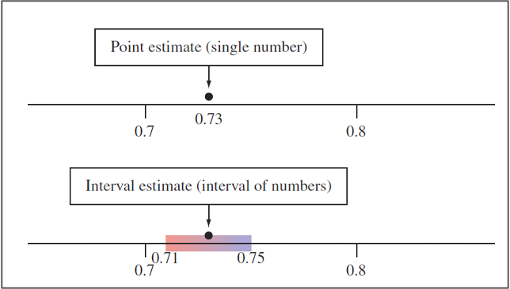

```{r setup, include=FALSE}
knitr::opts_chunk$set(warning = FALSE, message = FALSE) 
```

<center></center>

**FACULTAD DE CIENCIAS SOCIALES - PUCP**

Curso: SOC294 - Estadística para el análisis sociológico 1

Semestre 2024 - 2

# **1.Intervalos de confianza**

Con este tema, comenzaremos a enfocarnos en la estadística inferencial. El objetivo de esta es determinar una aproximación del parámetro poblacional a partir de la data de una muestra representativa.

Revisemos algunos conceptos:

-   **Estimador puntual:** un número que es nuestra predicción del parámetro

-   **Intervalo de confianza:** un intervalo de números basado en la distribución de la data observada de la muestra dentro de la cual se cree que estaría el parámetro poblacional.

    *IC = estimador puntual +-/margen de error*

-   **Nivel de confianza:** es la probabilidad de que el parámetro se encuentre en ese intervalo.

-   **Margen de error:** mide qué tan precisa es la estimación del parámetro.

-   **Error de muestreo:** diferencia entre el valor calculado de un estadístico y valor real de un parámetro de la población.

```{r,echo=FALSE, out.width="50%",fig.align="center"}
 
```

### Conceptualización e Importancia

-   Los intervalos de confianza ofrecen una manera de estimar, con alta probabilidad, un rango de valores en el que se encuentra el valor poblacional (o parámetro) de una determinada variable.
-   El intervalo de confianza describe la variabilidad entre la medida obtenida en un estudio y la medida real de la población (el valor real).
-   Un intervalo de confianza de 90%/95%/99% nos indica que dentro del rango dado se encuentra el valor real de un parámetro con 90%/95%/99% de certeza.
-   Existe una relación inversa entre la amplitud del IC y el tamaño muestral: mientras más pequeño es el n, más amplio es el IC. A mayor n, el IC es más estrecho.
-   Gracias al IC podemos determinar si la estimación es representativa de la población.

### Sobre el nivel de confianza...

Si tenemos un nivel de confianza de 95%, quiere decir que si realizamos 100 veces el mismo procedimiento de muestreo y calculamos los estadísticos de interés, 95 veces obtendremos los resultados en el intervalo calculado. Los mismo ocurriría si realizamos el cálculo con un 99% de confianza. Al momento de decidir el nivel de confianza debemos tener presente una regla: a mayor nivel de confianza, menor será la precisión ya que el intervalo es más amplio.

**Aplicación**

sobre la data

Explicación de la data

```{r, echo=FALSE, out.width="50%",fig.align="center"}
knitr::include_graphics("pd3-diccionario.png") 
```

```{r}
library(rio) #Convocamos el paquete   
data=import("Pd3_enpove2022.dta")
```

En esta sesión responderemos a la pregunta:

# ¿De qué manera experimentan los migrantes venezolanos la discriminación en el Perú?

## **1.Intervalos de confianza para una proporción**

Tengamos en consideración que para poder hallar el intervalo de confianza para una proporción debemos determinar nuestro caso de éxito. Asimismo, para hallar el intervalo de confianza para una proporción nuestra variable debe ser categórica y debe representar una variable dicotómica; es decir, una variable con solo dos categorías posibles: votó/no votó; sí/no, etc.

Recordemos la fórmula para hallar el intervalo de confianza para una proporción

```{r,echo=FALSE, out.width="50%",fig.align="center"}
knitr::include_graphics("ICprop.png") 
```

## *¿Qué proporción de venezolanos en Perú se siente discriminada?*

Para ello trabajaremos con la variable P701, que tiene dos valores posibles: Si y No.

Para poder encontrar el intervalo de confianza para la *proporción de venezolanos en Perú se siente discriminada*, necesitamos tener muy claro la frecuencia de nuestro caso de éxito y del total de casos.

```{r}
table(data$P701)
```

```{r}
x = 3104 #almacenamos en "x" la frecuencia de nuestro caso de éxito (Sí se sintieron discriminados)
n = 3104 + 7123 #almacenamos en "n" el total de casos
```

Hallamos el invervalo de confianza para una proporción con el comando **prop.test**

```{r}
ic_prop = prop.test(x,n)
ic_prop #llamamos a ic_prop para visualizar los resultados
```

Esto quiere decir que tenemos un 95% de certeza de que el porcentaje de venezolanos que residen en el Perú y se han sentido discriminados oscila entre el 29% y 31%.

# **2.Intervalos de confianza para una media**

Recordemos la fórmula para hallar el intervalo de confianza para una media es

```{r,echo=FALSE, out.width="50%",fig.align="center"}
knitr::include_graphics("ICmedia.png") 
```

Es importante mencionar que nuestra variable debe ser numérica, sino no podremos calcular su promedio.

### ¿Qué nivel de discriminación sufren los venezolanos en el Perú?

*Hallemos el intervalo de confianza para la media de la variable "nivel_discriminación". Esta variable será un indice aditivo del 0 al 100 creado a partir de las variables P702_1 a la P702_7*

Guardo mis variables de interes en un vector para luego realizar la misma modificación en todas. Para poder indicar que se omitan los perdidos para la suma, primero crearemos un vector que almacene los nombres de las variables que conformaran el indicador.

```{r}
library(dplyr)
library(scales)

indicador = c("P702_1","P702_2","P702_3","P702_4","P702_5","P702_6", "P702_7")

data = data %>% 
  mutate(suma =  rowSums(across(all_of(indicador)), na.rm = TRUE),
         nivel_discriminación = rescale(suma, to = c(0,10)),
         nivel_discriminación = ifelse(P701 == "2",NA, nivel_discriminación), 
)

```

Ahora que hemos creado el indicador de nivel de discriminación, realicemos un análisis descriptivo.

```{r}
data %>% 
  summarise(media = mean(nivel_discriminación, na.rm = T),
            mediana = median(nivel_discriminación,na.rm = T),
            sd = sd(nivel_discriminación, na.rm = T),
            min = min(nivel_discriminación, na.rm = T),
            max = max(nivel_discriminación, na.rm = T))
```

**ciMean**, del paquete **lsr**, es la función que calcula el intervalo de confianza de una media.

```{r}
library(lsr)
ic_media = ciMean(data$nivel_discriminación, na.rm = TRUE) #con el último argumento indicamos no tomar en consideracion los valores perdidos (NA)

ic_media
```

# **3.Intervalo de confianza de una media según grupo**

### ¿De qué manera la zona de Lima en la que vive la persona se relaciona con su gasto en transporte?

Hallemos el intervalo de confianza para el nivel de discriminación (nivel_discriminación) según estrato (ESTRATO).

Agreguemos etiquetas a la categórica

```{r}
table(data$ESTRATO)
```

```{r}
library(dplyr)
data = data %>% 
  mutate(ESTRATO=factor(ESTRATO, levels = (1:5), labels = c("Bajo","Medio bajo","Medio", "Medio alto", "Alto")))
```

1\. Crearemos una tabla con la media, máximo y mínimo de la variable nivel_discriminación, en base al grupo de ESTRATO.

```{r}
ic_grupo = data %>% 
  group_by(ESTRATO) %>% 
  summarise(Media = mean(nivel_discriminación, na.rm=T),
            min = ciMean(nivel_discriminación, na.rm=T)[1],
            max = ciMean(nivel_discriminación, na.rm=T)[2])
ic_grupo
```

Según nuestra tabla, podemos afirmar que hay un 95% de probabilidad de que la media del grupo de Estrato Alto percibe, ligeramente, un mayor nivel de discriminación a comparación del resto. Igualmente, podemos observar que, dentro de todos los grupos, el nivel promedio de discriminación es bastante similar.

Grafiquemos nuestros resultados.

```{r}
library(ggplot2)
ggplot(ic_grupo, aes(x= ESTRATO, y =Media)) +
  geom_errorbar(aes(ymin=min, ymax=max), width = 0.2)+
   geom_text(aes(label=paste(round(Media, 2))), size=4)+
  xlab("Estrato") + ylab("Promedio del nivel de discriminación")+
  ylim(1, 3) #indicamos los límites del eje y
```

Con lo que muestra el gráfico, ¿cómo podemos complementar nuestra interpretación anterior?

# **Ejercicio**
