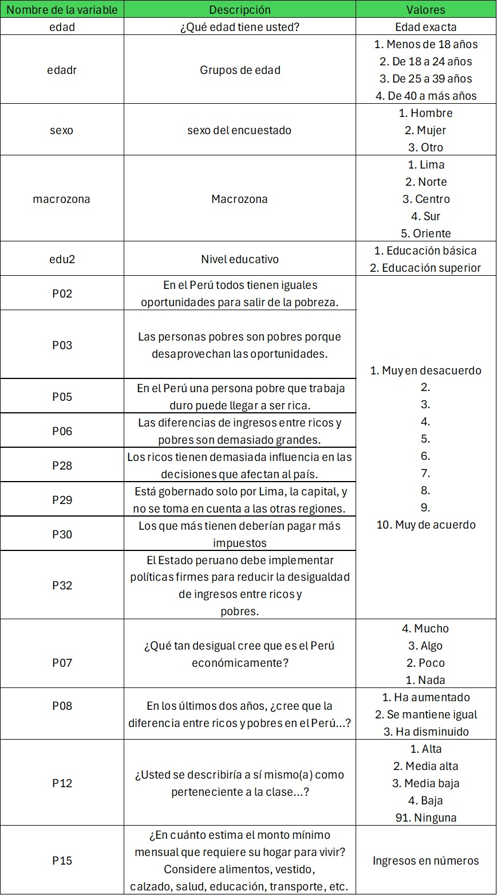

```{r setup, include=FALSE}
knitr::opts_chunk$set(echo = TRUE)
```

**FACULTAD DE CIENCIAS SOCIALES - PUCP**

Curso: SOC294 - Estadística para el análisis sociológico 1

Semestre 2024 - 2

## **Recordando lo avanzado**

En la sesión anterior de teoría, nos adentramos al análisis inferencial
bivariado, teniendo como base del tema el cálculo del Intervalo de
Confianza (IC) para una media (variables numéricas) y para una
proporción (variables categóricas). Recordemos que gracias al IC podemos
determinar si la estimación es representativa de la población. La idea
era calcular los intervalos de confianza para cada grupo y ver si los
intervalos se interceptan o no. La regla era que si los intervalos de
ambos grupos no se interceptaban, podíamos extrapolar que la diferencia
muestral existe en la población al 95% de confianza. Para profundizar
sobre estadística inferencial, evaluaremos las hipótesis mediante la
introducción a la prueba t de diferencia de medias y desarrollaremos los
cincos pasos de la inferencia estadística. Recordemos que el objetivo es
corroborar que es posible extrapolar un resultado de la muestra a la
población.

# **Prueba T**

## **쯈ué es la prueba T de diferencia de medias?**

Generalmente, cuando queremos comparar dos grupos centramos nuestra
atención en el promedio de cada uno. Sin embargo, el hecho de que los
promedios sean distintos no supone, necesariamente, que existe una
diferencia estadísticamente significativa.

Para saber si la diferencia observada entre las medias de dos grupos es
o no significativa se emplean métodos paramétricos como el de Z-scores o
la distribución T-student. Estas técnicas calculan los intervalos de
confianza de cada grupo y concluyen si existe una diferencia real entre
las medias.

La prueba T compara la media de una variable numérica para dos grupos o
categorías de una variable nominal u ordinal. Los grupos que forman la
variable nominal/ordinal tienen que ser independientes. Es decir, cada
observación debe pertenecer a un grupo o al otro, pero no a ambos.

## **Pruebas T para muestras independientes**

*Condiciones*

1.  Independencia: Las muestras deben ser independientes. El muestreo
    debe ser aleatorio.

2.  Igualdad de varianza: La varianza de ambas poblaciones comparadas
    debe ser igual.

3.  La variable numérica se distribuye de manera normal.

***IMPORTANTE***

La condición de normalidad también es considerada si es que la muestra
fuera pequeña (Agresti y Finlay proponen que se aplica con un n pequeño
menor a 30 observaciones). A medida que el n se hace más grande, el
supuesto de normalidad es menos importante pues con grandes n confiamos
en el teorema del límite central que nos indica que la distribución
muestral será siempre normal.

## **Pasos para realizar la Prueba T**

1.  Establecer hipótesis

2.  Calcular el estadístico (parámetro estimado) que se va a emplear

3.  Determinar el nivel de significancia α (alpha)

4.  Calcular el p-value y realizar la prueba prop.test

5.  Interpretar

**Recuerda**

El H0 de la prueba T es la siguiente:

**H0:** No existe diferencia estadísticamente significativa entre las
medias de los dos grupos comparados.

**H1:** Sí existe diferencia estadísticamente significativa entre las
medias de los dos grupos comparados.

*La H0 es generalmente la hipótesis de no efecto, de no diferencias.*

# **Apliquemos**

### **Insertar pregunta general 🤔**

Para dar respuesta a la pregunta de investigación que guiara la práctica
dirigida analizaremos algunas de las variables que forman parte de la
Encuesta Nacional de Percepción de Desigualdades - ENADES 2024, que fue
elaborada por Instituto de Estudios Peruanos (IEP) y Oxfam. La encuesta
busca ahondar en la percepción de las diferentes formas de desigualdad
en el Perú e incorpora indicadores que permiten medir la magnitud de
brechas sociales y políticas como género, clase, entre otros.

Se eligieron algunas variables de la base de datos original y se dejaron
por fuera valores perdidos además de realizar otras modificaciones. Para
realizar alguna investigación se debe usar la base de datos original que
se encuentra en el siguiente [link](https://peru.oxfam.org/ENADES-2024).

```{r}
library(rio)
data = import("pd4_enades2024.sav")
```

```{r, echo=FALSE, out.width="50%",fig.align="center"}
 
```

## 1. 쮼xiste una diferencia estadísticamente significativa entre la estimación del monto mínimo mensual del hogar según nivel educativo alcanzado?

Crearemos una tabla con la media, máximo y mínimo de la variable
nivel_discriminación, en base al grupo de edu2

Agreguemos etiquetas:

```{r}
library(dplyr)
data = data  %>%  
  mutate(edu2 = factor(edu2, levels = 1:2, labels = c("E. Básica","E. Superior")))

```

```{r}
library(lsr)
NivelEdu = data %>% 
  group_by(edu2)  %>% 
  summarize(Media = mean(P15, na.rm = T),
  min = ciMean(P15, na.rm=T)[1],
  max = ciMean(P15, na.rm=T)[2])
NivelEdu
```

```{r}
NivelEdu[2,2] - NivelEdu[1,2] 
```

La diferencia es de aprox 1124 soles. 쯇uedo afirmar que existe esta
diferencia en la población?

Para poder evaluar si existen o no diferencias poblacionales usaremos
t.test.

Recuerda que primero se indica la variable numérica y luego la
categoríca dicotómica.

```{r}
t.test(P15 ~ edu2, data = data)
```

El valor p- value es \< 2.2e-16, que es menor que el nivel típico de
significancia (generalmente α = 0.05). Un valor p alto sugiere que no
hay suficiente evidencia para rechazar la hipótesis nula. En otras
palabras, podemos concluir que existe una diferencia significativa entre
las medias de los dos grupos (Educación Básica y Educación Superior) con
respecto a la variable P15

Graficamos los resultados

```{r}
library(ggplot2)
ggplot(NivelEdu, aes(x = edu2, y = Media)) +
  geom_errorbar(aes(ymin = min, ymax = max), width = 0.2) +
  ggtitle("Estimación del monto mínimo mensual del hogar \nsegún máximo nivel educativo") +
  # Etiquetas de la media
  geom_text(aes(label = paste(round(Media, 2))), vjust = 0.5, size = 3) +
  # Etiquetas de los valores mínimos
  geom_text(aes(y = min, label = paste("min:", round(min, 2))), 
            vjust = 1.5, hjust = -0.6, size = 2, color = "#00688B") +
  # Etiquetas de los valores máximos
  geom_text(aes(y = max, label = paste("max:", round(max, 2))), 
            vjust = -0.5, hjust = -0.6, size = 2, color = "#00688B") +
    theme_light()+
  xlab("Máximo nivel educativo alcanzado") + 
  ylab("Promedio del gasto mínimo mensual") 

```

## 2. 쮼xiste una diferencia en el nivel de acuerdo con la frase "los que más tienen deberían pagar más impuestos" según si la persona pertenece a una clase social alta o media alta o no?

Para responder a la pregunta identifiquemos la variable numérica y la
categórica primero.

La variable númerica es la P30, que es una likert y va del 1 al 10.

La categórica se basa en **clase**, todo lo que sea 1 o 2 (Clase
Alta/Media Alta) será "Alta/Media alta" y lo que no, será "No alta/media
alta".

```{r}
table(data$clase)
data = data %>% 
  mutate(Clase2= ifelse(clase <3, "Alta/Media alta", "No alta/Media alta" ))

```

쮿ay diferencia entre ambos grupos en la muestra?

```{r}
clase = data %>% 
  filter(!is.na(Clase2)) %>% 
  group_by(Clase2)  %>% 
  summarize(Media = mean(P30, na.rm = T),
  min = ciMean(P30, na.rm=T)[1],
  max = ciMean(P30, na.rm=T)[2])
clase
```

El análisis descriptivo muestra que las medias de ambos grupos se
encuentran a 0.6 puntos de distancia.

Para poder evaluar si existen o no diferencias poblacionales usaremos
t.test.

```{r}
t.test(P30 ~ Clase2, data = data)
```

```{r}
ggplot(clase, aes(x = Clase2, y = Media)) +
  geom_errorbar(aes(ymin = min, ymax = max), width = 0.2) +
  ggtitle("Estimación del nivel de acuerdo con 'Los que más \ntienen deberían pagar más impuestos' según clase") +
  # Etiquetas de la media
  geom_text(aes(label = paste(round(Media, 2))), vjust = 0.5, size = 3) +
  # Etiquetas de los valores mínimos
  geom_text(aes(y = min, label = paste("min:", round(min, 2))), 
            vjust = 1.5, hjust = -0.6, size = 2, color = "#00688B") +
  # Etiquetas de los valores máximos
  geom_text(aes(y = max, label = paste("max:", round(max, 2))), 
            vjust = -0.5, hjust = -0.6, size = 2, color = "#00688B") +
  theme_light()+
  xlab("쮼s de clase alta o media alta?") + 
  ylab("Promedio del nivel de acuerdo con \nLos que más tienen deberían pagar más impuestos") 
```

Ejercicios:

1.  Analiza si existen diferencias en la población entre el promedio de
    monto estimado para vivir (P15) entre hombres y mujeres (sexo) con
    la prueba, el gráfico y la interpretación correspondiente.
2.  Analiza si existen diferencias en la población entre el nivel de
    acuerdo con la frase que indica que solo se gobierna para Lima(P29)
    entre si el encuestad\@ vive en Lima o no (variable basada en
    macrozona) con la prueba, el gráfico y la interpretación
    correspondiente. Para ello debe de crear previamente una variable
    llamada Lima que se base en macrozona, si macrozona es Lima,
    entonces la nueva variable también será "Lima", todo lo demás será
    "No Lima".
