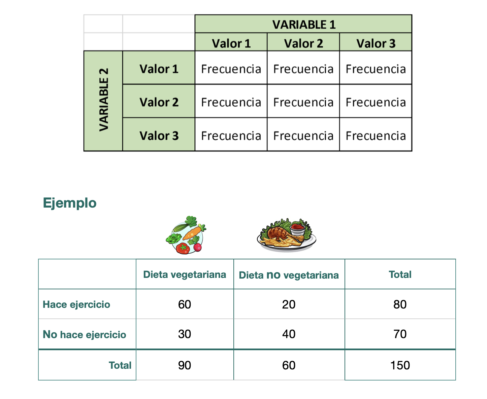
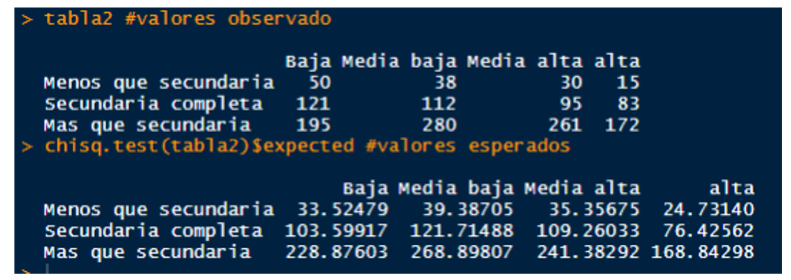
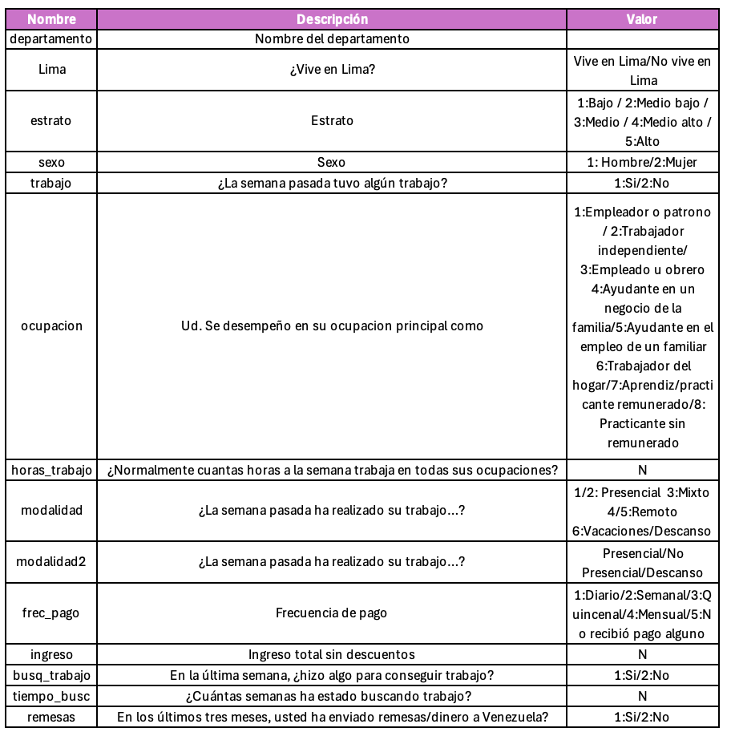

```{r setup, include=FALSE}
knitr::opts_chunk$set(echo = TRUE)
```

**FACULTAD DE CIENCIAS SOCIALES - PUCP**

Curso: SOC294 - Estadística para el análisis sociológico 1

Semestre 2024 - 2

## **Tablas de contingencia**

-   Son tablas de doble entrada, en las cuales se cruzan las categorías
    de dos variables de interés.

-   En las casillas de la tabla se ubica la frecuencia o el número de
    casos de cada cruce.

-   Conceptos importantes: Frecuencias observadas y frecuencias
    esperadas.

```{r, echo=FALSE, out.width="50%",fig.align="center"}
 
```

## **Frecuencias observadas y esperadas**

-   Frecuencia esperada: Estas son las frecuencia que deberían darse si
    las variables fueran independientes.

-   Frecuencia observada: Estas son las frecuencias reales que se
    observa en nuestra data.

Ejemplo:

```{r, echo=FALSE, out.width="50%",fig.align="center"}
 
```

# **Prueba Chi2**

Chi2 es una prueba para estimar el grado de asociación entre variables
categóricas:

-   “Nominal - Nominal”,

-   “Nominal - Ordinal”

-   “Ordinal - Ordinal”

Esto significa que una parte de la variabilidad de una variable puede
ser explicada por otra variable.

Supuestos:

Para analizar asociación se requiere que el número de observaciones
esperadas en cada celda de la tabla de contingencia debe ser
suficientemente grande.

Para fines de este curso, al menos cada celda de la tabla de
contingencia de frecuencias esperadas debe ser de 5.

Ten en cuenta que si estas condiciones no se cumplen, entonces la prueba
podría no funcionar adecuadamente y los resultados de la prueba podrían
no ser válidos.

Hipótesis:

-   Hipótesis nula (H0): Las variables son estadísticamente
    independientes (No hay asociación) 🚫

-   Hipótesis alternativa (H1): Las variables son estadísticamente
    dependientes (Sí hay asociación)✅

Que dos variables estén asociadas significa que parte de la variabilidad
en una variable puede ser explicada por la otra variable.

El Chi2 específica grado de asociación, **NO LA FORMA DE ASOCIACIÓN**.

# **Ejercicio**

Para la clase de hoy, se usará la base de datos de la ENPOVE 2022, el
módulo de empleo. Esta "es una investigación estadística que permite
suministrar información estadística que refleje la situación migratoria
de la población venezolana refugiada y migrante en el Perú, con énfasis
en el contexto de la pandemia por la COVID-19, para así apoyar a tomar
las decisiones de política pública basadas en datos sólidos y
confiables"

```{r, echo=FALSE, out.width="50%",fig.align="center"}
 
```

```{r}
library(rio) #Convocamos el paquete   
data=import("PD5_enpove2022.sav")
```

## **¿Existe una relación significativa entre el estrato con el envío deremesas?**

**PASO 1: Tabla de contingencia**

```{r}
library(dplyr)
data = data %>% 
  mutate(estrato = factor(estrato,labels=c("Bajo","Medio bajo","Medio","Medio alto","Alto"))) %>% 
  mutate(remesas = factor(remesas,labels=c("Sí","No")))
```

```{r}
table(data$remesas)
```

```{r}
tabla1=table(data$estrato,data$remesas)
tabla1
```

Revisamos el supuesto

```{r}
chisq.test(tabla1)$expected
```

En este caso sí cumple el supuesto!😎

Creamos porcentajes por columna, para ello tenemos que agregar
prop.table al comando anterior. El argumento de prop.table puede ser

1: para calcular porcentaje por fila

2: para calcular por columna ⚠️ Recuerda que es recomendable calcular
los porcentajes sobre la variable sociodemográfica o aquella que
antecede a la otra.

```{r}
tablapor1 = tabla1 %>%
           prop.table(1) %>%  
           round(2) #redondear el resultado a 2 decimales
tablapor1
```

**PASO 2: Tabla de contingencia**

```{r}
toPlot1 = as.data.frame(tablapor1) 
names(toPlot1) = c("Estrato", "Remesa", "Porcentaje")
```

```{r}
library(ggplot2)
  ggplot(toPlot1, aes(x=Estrato, y=Porcentaje*100, fill=Remesa)) +
  geom_bar(position="stack", stat="identity")+ #Stack indica que son barras apiladas
  geom_text(aes(label=paste0(Porcentaje*100,"%")), 
            position = position_stack(vjust = 0.5), 
             size = 4,
             fontface="bold")+
  labs(x="Estrato", y="Porcentaje", fill="¿Envía remesa?")+
  theme_minimal()
```

De forma preliminar ¿Hay diferencias entre la forma cómo se distribuye
la variable “Situación Económica” en cada subgrupo (hombre y mujer)?

**PASO 3: Prueba Chi2**

```{r}
chisq.test(tabla1)
```
De acuerdo al p-value obtenido en la prueba de hipótesis de Chi2, al ser menor de 0.05, podemos rechazar la hipótesis nula (Las variables son independientes)

Por lo tanto, podemos concluir que existe dependencia entre las variables escogidas. Esto quiere decir que el estrato SÍ se vincula con el envío de remesas. 