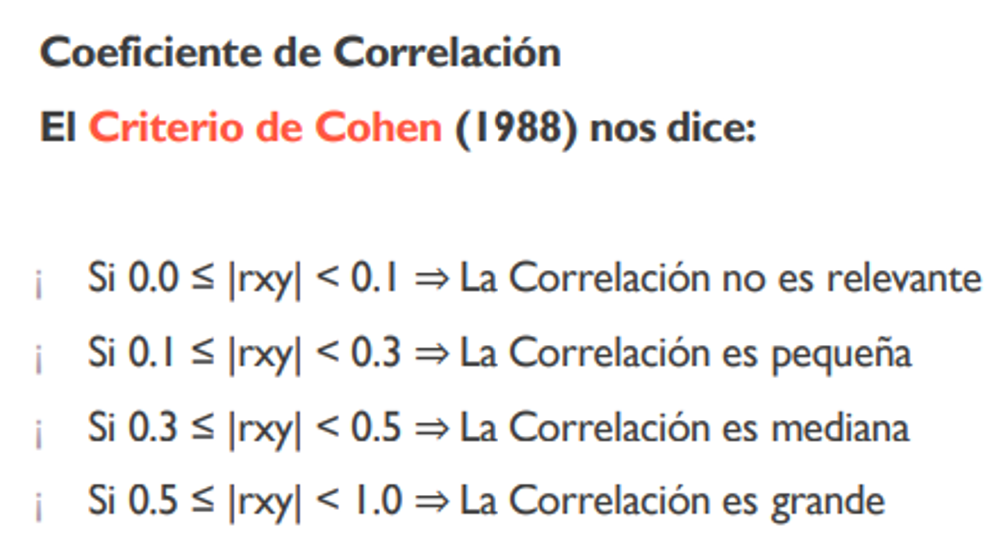
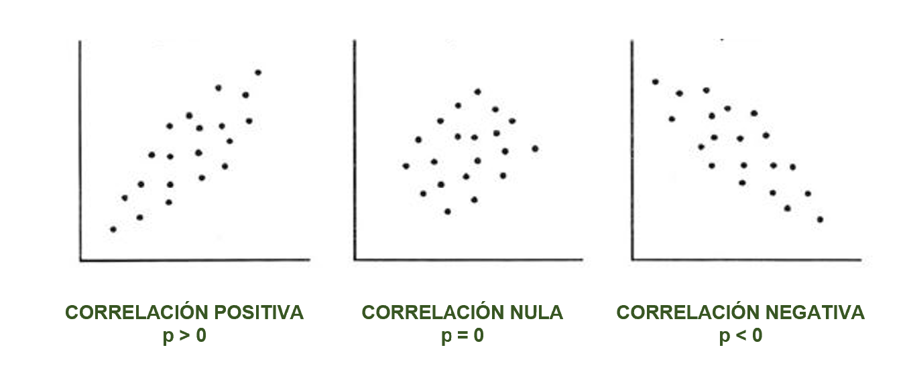
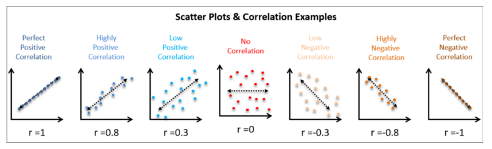

FACULTAD DE CIENCIAS SOCIALES - PUCP

Curso: SOC294 - Estadística para el análisis sociológico 1

Semestre 2024 - 2

## **Diagramas de dispersión y correlación**

### Ideas clave

La correlación es en esencia una medida normalizada de asociación o
covariación lineal entre dos variables.

-   La **correlación** es una medida de la relación (covariación) entre
    **dos variables cuantitativas.**

-   La manera más sencilla de saber si dos variables están
    correlacionadas es determinar si co-varían (varían conjuntamente).

-   Es importante hacer notar que **esta covariación o relación no
    implica necesariamente causalidad**: La correlación puede ser
    fortuita, como en el caso clásico de la correlación entre el número
    de venta de helados e incendios, debido al efecto de una tercera
    variable, la temperatura ambiental. A este tipo de relación se le
    llama "espuria".

### Hipótesis de la prueba de correlación

-   H0 : No existe correlación entre las variables
-   H1 : Existe correlación entre las variables

### Coeficiente de Correlación de Pearson

-   "El Coeficiente de Correlación de Pearson es un estadístico
    paramétrico, pues se asume que ambas variables tienen una
    distribución aproximadamente normal, o sea, distribución normal
    bivariante".

-   Es una medida que **puede variar entre -1 y +1**, ambos extremos
    indicando correlaciones perfectas, negativa y positiva
    respectivamente.

-   Un valor de r = 0 indica que no existe relación lineal entre las dos
    variables.



### Gráfico de dispersión



Otros ejemplos:



### Aplicación práctica

# ¿Que factores se relacionan con la tasa de fecundidad en los países?

¿Cómo se relaciona la tasa de fecundidad con la esperanza de vida de las
mujeres en los países?

```{r}
cor.test(data$tfr, data$lifExpFem)
```

¿Cómo se relaciona la tasa de fecundidad con el ingreso per cápita en
los países?

```{r}
cor.test(data$tfr, data$incomePp)
```

¿Cómo se relaciona la tasa de fecundidad con la participación masculina
en la fuerza laboral en los países?

```{r}
cor.test(data$tfr, data$maleWork)
```

¿Cómo se relaciona la tasa de fecundidad con la participación femenina
en la fuerza laboral en los países?

```{r}
cor.test(data$tfr, data$femWork)
```

Ejercicios para clase

1.  ¿Cómo se relaciona la tasa de fecundidad (tfr) con la equidad de
    género en la educación en los países (schGenEq)?

2.  ¿Cómo se relaciona la tasa de fecundidad (tfr) con el porcentaje de
    personas con acceso a agua en los países (water)?
